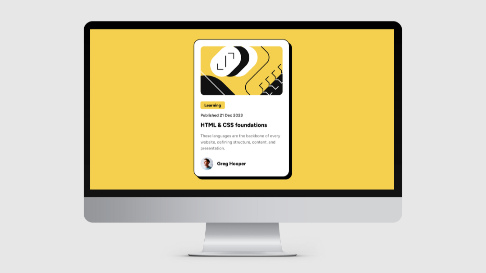

# Blog preview card - Solution
This is the solution to the [Blog preview card challenge on Frontend Mentor](https://www.frontendmentor.io/challenges/blog-preview-card-ckPaj01IcS). This solution ensures a visually appealing and responsive blog preview card  with optimal layout for various screen sizes.
## Table of contents

- [Overview](#overview)
  - [The challenge](#the-challenge)
  - [Screenshot](#screenshot)
  - [Links](#links)
- [My process](#my-process)
  - [Built with](#built-with)
  - [What I learned](#what-i-learned)
  - [Useful resources](#useful-resources)
- [Author](#author)

## Overview

### The challenge


- Develop the given Blog preview card. 

- Users should be able to view the optimal layout for the site depending on their device's screen size.

### Screenshot

- Design preview of the Blog preview card




### Links

- Solution URL: [Click here](https://github.com/sayeedmunees/blog-preview-card-challenge)

- Live Site URL: [Click here](https://sayeedmunees.github.io/blog-preview-card-challenge/)

## My process

### Built with

- Semantic HTML5 markup
- CSS custom properties
- CSS Flexbox
- Mobile-first workflow

### What I learned


Throughout this project, I've discovered the transformative power of Flexbox in crafting responsive layouts, providing a seamless experience across various devices. Transitioning from inline-block elements to Flexbox has not only streamlined the design process but also mitigated layout inconsistencies. Furthermore, implementing subtle box-shadow transitions upon hover has elevated the aesthetics and interactivity of the interface, enhancing user engagement.

Here's a snippet demonstrating the use of Flexbox and box-shadow transitions upon hover:

```css
#card-wrap:hover #card {
    box-shadow: 15px 15px 0px 0px rgba(0, 0, 0, 1);
    transition: all 300ms ease-in-out 0s;
}

#illustration-container {
    display: flex;
    flex-direction: column;
    justify-content: center;
    border-radius: 15px;
    overflow: hidden;
    margin-bottom: 25px;
}

```

### Useful resources

- [Frontend Mentor](ttps://www.frontendmentor.io/challenges/blog-preview-card-ckPaj01IcS) - Got this challenge from Frontend Mentor,along with workfiles like required designs, icons and other files.

- [MDN Docs](https://developer.mozilla.org/en-US/) - Here's another useful resourse, which is the MDN web Docs itself. It helped me to find, understand and to use code snippets that i didn't knew before.


## Author

- GitHub - [@sayeedmunees](https://github.com/sayeedmunees)
